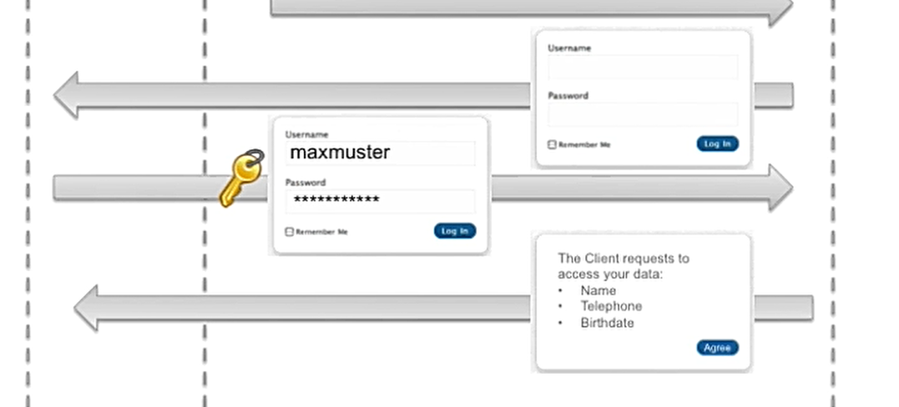
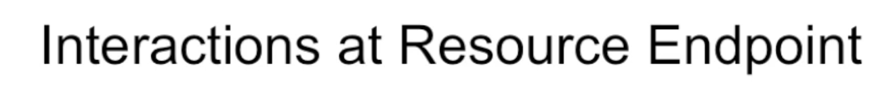

001 Usage Scenario and Features of this Flow

The Authorization Code Flow is used to obtain an access token to authorize the user. This flow is used when the client application is a web application. The flow is initiated by the client application, which redirects the user to the authorization server. The user authenticates and authorizes the client application. The authorization server then redirects the user back to the client application with an authorization code. The client application then exchanges the authorization code for an access token.

The Authorization Code Flow is a two-step process:

1. Authorization Request
2. Access Token Request

The Authorization Code Flow is a secure method for obtaining an access token. The client application never sees the user's credentials, and the user never sees the access token. The flow is also more secure than the Implicit Flow, as the access token is never exposed in the URL.

Authorization Code Grant

The Authorization Code Grant is a secure method for obtaining an access token. The client application never sees the user's credentials, and the user never sees the access token. The flow is also more secure than the Implicit Flow, as the access token is never exposed in the URL.

The Authorization Code Grant is a two-step process:

1. Authorization Request

The client application initiates the flow by redirecting the user to the authorization server. The client application includes the following parameters in the request:

- `response_type`: Set to `code` to indicate that the client application is using the Authorization Code Grant.
- `client_id`: The client ID of the client application.
- `redirect_uri`: The URL to which the authorization server should redirect the user after the user authenticates and authorizes the client application.
- `scope`: The requested scope of the access token.
- `state`: A random string generated by the client application. The state is used to prevent CSRF attacks.

2. Access Token Request

After the user authenticates and authorizes the client application, the authorization server redirects the user back to the client application with an authorization code. The client application then exchanges the authorization code for an access token. The client application includes the following parameters in the request:

- `grant_type`: Set to `authorization_code` to indicate that the client application is using the Authorization Code Grant.
- `code`: The authorization code received from the authorization server.
- `redirect_uri`: The URL to which the authorization server should redirect the user after the user authenticates and authorizes the client application.
- `client_id`: The client ID of the client application.
- `client_secret`: The client secret of the client application.

002 Authorization Code Flow Authorization Endpoint

Step one Resource Owner (User) uses a third part application to access a protected resource on the resource server.

Step two The third party application redirects the user to the authorization server. The user authenticates and authorizes the third party application.

- `response_type`: Set to `code` to indicate that the client application is using the Authorization Code Grant.
- `client_id`: The client ID of the client application.
- `redirect_uri`: The URL to which the authorization server should redirect the user after the user authenticates and authorizes the client application.
- `scope`: The requested scope of the access token.
- `state`: A random string generated by the client application. The state is used to prevent CSRF attacks.

third party app need to register with the authorization server to get the client_id and client_secret.

the redirect_uri is the url of the third party app that the user will be redirected to after the user authenticates and authorizes the third party app.this has to be registered with the authorization server before hand.

then the auth server redirect the user to the login page where the user will enter the credentials and authorize the third party app.

it usually ask the user to authorize the third party app to access the user data. in the browser the user will see the url with the code and state.

003 Authorization Code Flow Token Endpoint and Resource Access

