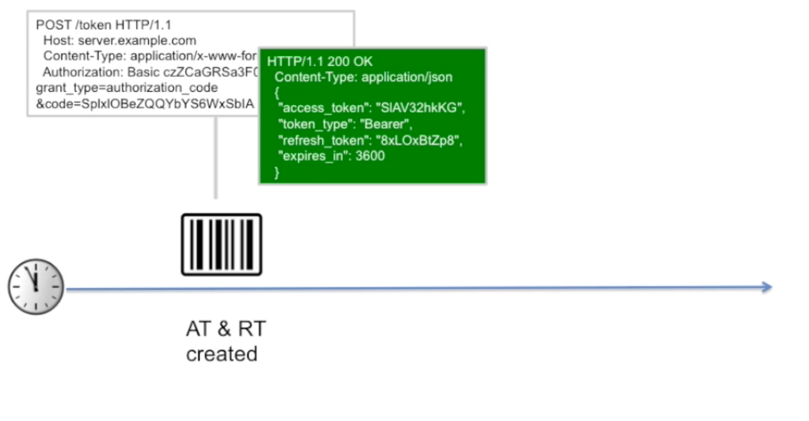

001 Usage Scenario and Features of the Refresh Flow

002 Authorization Code Flow Refreshing Tokens

in a rerfresh token flow the client application can obtain a new access token without requiring the user to re-authenticate. this is useful when the access token expires and the client application needs to access the protected resource again.

