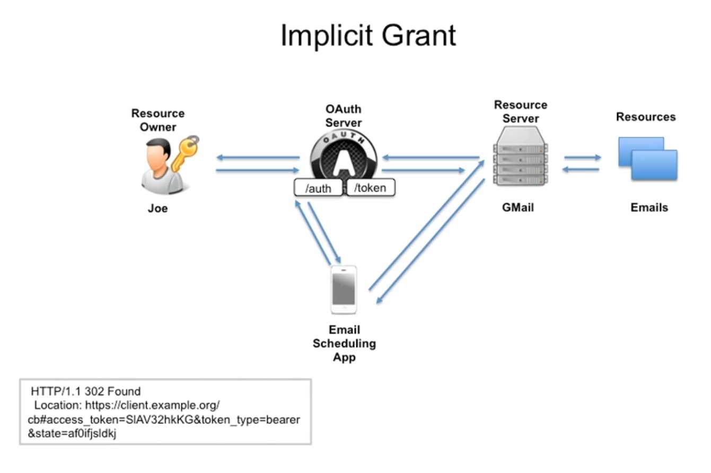

001 Usage Scenarios and Features of the Implicit Flow

Implicit Flow is used to obtain an access token to authorize the user. This flow is used when the client application is a web application. The flow is initiated by the client application, which redirects the user to the authorization server. The user authenticates and authorizes the client application. The authorization server then redirects the user back to the client application with an access token.

in this case there is no refresh token. the access token is returned directly to the client application.

