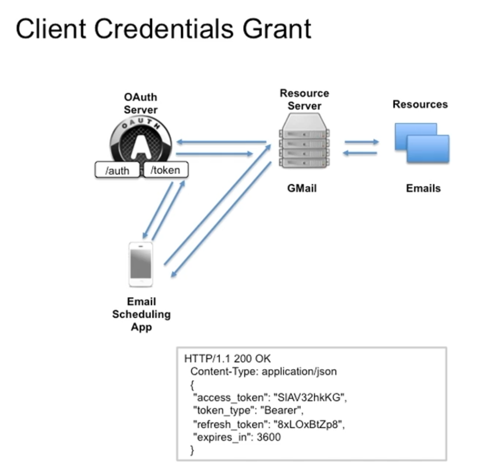

001 Usage Scenarios and Features of the Client Credentials Flow

when Client is the Resource Owner and the Client is the Resource Server.

in this flow the client application is the resource owner and the resource server. the client application uses its own credentials to obtain an access token to access its own protected resources.

