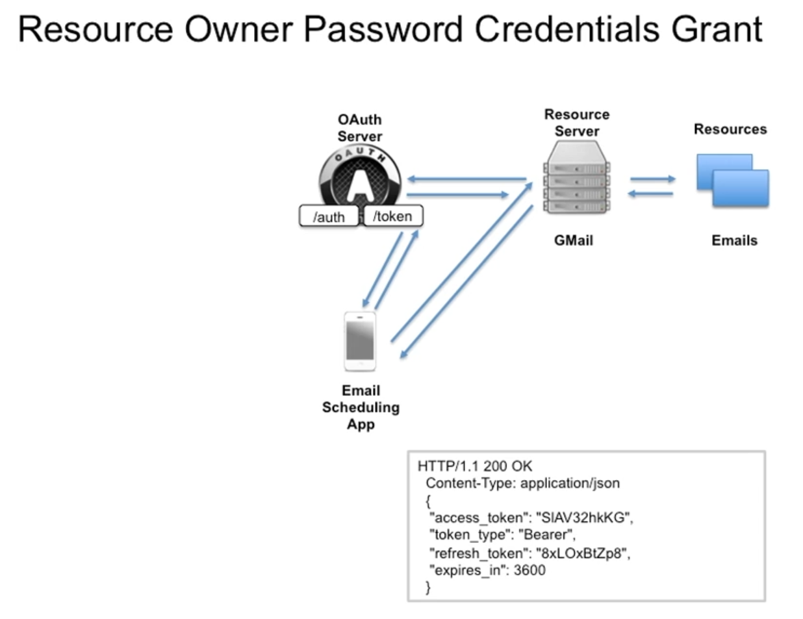

001 Usage Scenarios and Features of the Resource Owner Password Credentials Flow.

The Resource Owner Password Credentials Flow is used to obtain an access token to authorize the user. This flow is used when the client application is a highly trusted application, such as a native application or a command-line tool. The flow is initiated by the client application, which requests the user's credentials and exchanges them for an access token.

The Resource Owner Password Credentials Flow is a two-step process:

1. Access Token Request

The client application initiates the flow by sending a POST request to the token endpoint. The client application includes the following parameters in the request:

- `grant_type`: Set to `password` to indicate that the client application is using the Resource Owner Password Credentials Flow.

- `username`: The username of the user.

- `password`: The password of the user.

- `scope`: The requested scope of the access token.

- `client_id`: The client ID of the client application.

- `client_secret`: The client secret of the client application.

2. Access Token Response

The authorization server validates the user's credentials and responds with an access token. The client application can then use the access token to access the protected resources.

The Resource Owner Password Credentials Flow is a less secure method for obtaining an access token. The client application sees the user's credentials, and the user never sees the access token. The flow is also less secure than the Authorization Code Flow, as the access token is exposed to the client application.

Resource Owner Password Credentials Grant

The Resource Owner Password Credentials Grant is a less secure method for obtaining an access token. The client application sees the user's credentials, and the user never sees the access token. The flow is also less secure than the Authorization Code Flow, as the access token is exposed to the client application.

The Resource Owner Password Credentials Grant is a two-step process:

1. Access Token Request

The client application initiates the flow by sending a POST request to the token endpoint. The client application includes the following parameters in the request:

- `grant_type`: Set to `password` to indicate that the client application is using the Resource Owner Password Credentials Grant.

- `username`: The username of the user.

- `password`: The password of the user.

- `scope`: The requested scope of the access token.

- `client_id`: The client ID of the client application.

- `client_secret`: The client secret of the client application.

2. Access Token Response

The authorization server validates the user's credentials and responds with an access token. The client application can then use the access token to access the protected resources.



example of a request to the token endpoint using the Resource Owner Password Credentials Flow:

```http
POST /token HTTP/1.1
Host: server.example.com
Content-Type: application/x-www-form-urlencoded

grant_type=password&username=johndoe&password=A3ddj3w&scope=read write&client_id=client_id&client_secret=client_secret
```

in this case client should not store the user credentials and should not use this flow if the client application is not highly trusted. the client application should also use the Authorization Code Flow or the Implicit Flow if possible. the Resource Owner Password Credentials Flow should only be used when the client application is a highly trusted application, such as a native application or a command-line tool.
